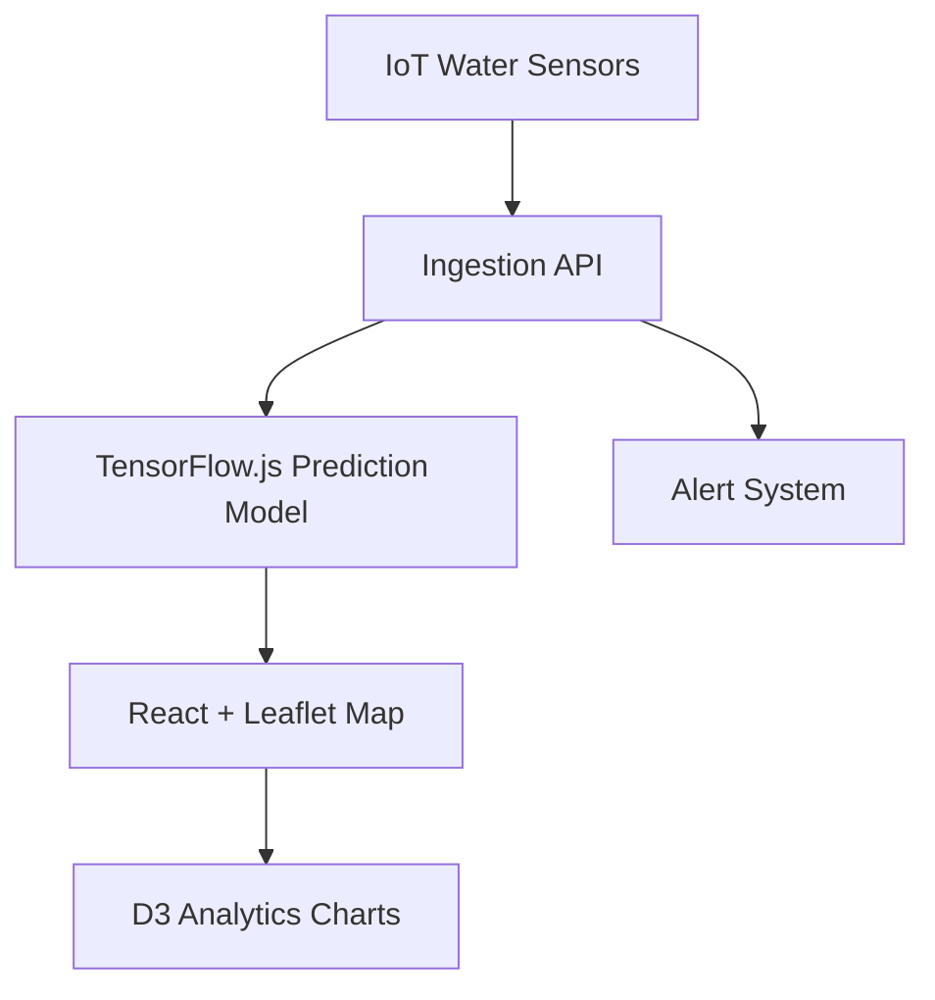

# Thailand Flood Monitor — Real-time IoT + ML Predictions

> **See floods before they happen.** Real-time monitoring with IoT sensor feeds and ML flood predictions on interactive maps.

### Demo

> 🎬 **Demo coming soon** — screen capture will be added at `docs/demo.gif`

### Architecture

### Results

| Metric | Value |
|---|---|
| **Prediction** | ML flood forecasting |
| **Visualization** | Leaflet maps + D3 charts |
| **Impact** | Public-good infrastructure |

---

**Phirawit Jitnarong — Strategic Full-Stack & AI Engineer**

xme176@gmail.com · 092-551-0427 · [LinkedIn](https://www.linkedin.com/in/%E0%B8%9E%E0%B8%B5%E0%B8%A3%E0%B8%A7%E0%B8%B4%E0%B8%8A%E0%B8%8D%E0%B9%8C-%E0%B8%88%E0%B8%B4%E0%B8%95%E0%B8%93%E0%B8%A3%E0%B8%87%E0%B8%84%E0%B9%8C-0000393a4) · [Fastwork](https://fastwork.co/user/bravforcode?source=search)

> Hiring for this stack? Let's talk — production hardened, 300k+ users shipped.